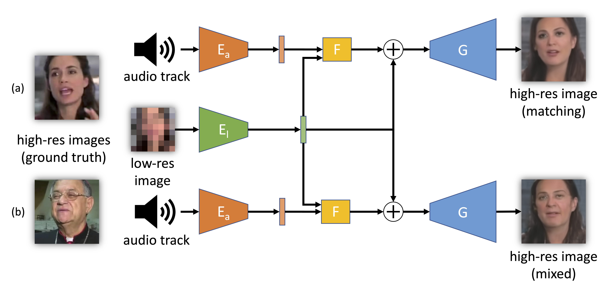
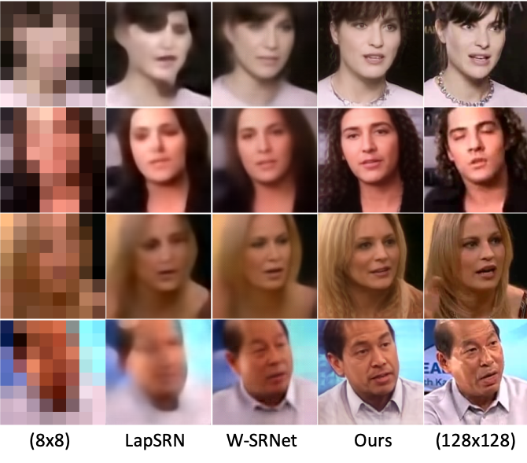

  <b style="font-size: 24px">Paper:</b> 
  <a href="https://arxiv.org/abs/1909.12780" style="font-size: 24px; text-decoration: none">[Arxiv]</a>

  

  <b style="font-size: 24px">Code:</b> 
  <a href="https://github.com/gmeishvili/ear_for_face_super_resolution" style="font-size: 24px; text-decoration: none">[GitHub]</a>

  

***Simplified training and operating scheme of the proposed model.*** *The model can be used (a) with matching inputs or (b) by mixing low-resolution images with audios from other videos. The low-resolution image (8 × 8 pixels) is fed to an encoder El to obtain an intermediate latent representation. A residual is computed by fusing in the network F the encoded audio track (through the encoder Ea) with the encoded low-resolution image. The residual is used to update the latent representation of the low-resolution image and then produce the high-resolution image through the generator G.*

___

# Abstract

We propose a novel method to use both audio and a low-resolution image to perform extreme face super-resolution (a 16× increase of the input size). When the resolution of the input image is very low (e.g., 8 × 8 pixels), the loss of information is so dire that important details of the original identity have been lost and audio can aid the recovery of a plausible high-resolution image. In fact, audio carries information about facial attributes, such as gender and age. Moreover, if an audio track belongs to an identity in a known training set, such audio might even help to restore the original identity. Towards this goal, we propose a model and a training procedure to extract information about the face of a person from her audio track and to combine it with the information extracted from her low-resolution image, which relates more to pose and colors of the face. We demonstrate that the combination of these two inputs yields high-resolution images that better capture the correct attributes of the face. In particular, we show experimentally that audio can assist in recovering attributes such as the gender, the age and the identity, and thus improve the correctness of the image reconstruction process. Our procedure does not make use of human annotation and thus can be easily trained with existing video datasets. Moreover, we show that our model builds a factorized representation of images and audio as it allows one to mix low-resolution images and audio from different videos and to generate realistic faces with semantically meaningful combinations.

___

# Results

    

***Comparison to other super-resolution methods on our test set.*** *The first column shows the 8 × 8 pixels in- puts; the second column shows the output of LapSRN; the third column shows the output of W-SRNet. Our model is shown in the fourth column. The ground-truth high-resolution image is shown in the last column.*

